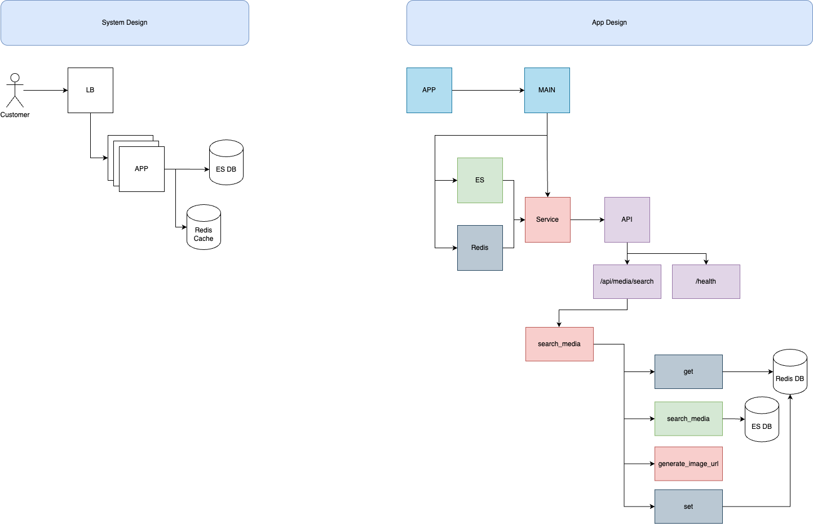

# MediaSearchAPI

## Overview
MediaSearchAPI is a robust Python backend service designed to retrieve and serve media content stored in Elasticsearch. It provides a user-friendly API for searching, filtering, and retrieving media URLs, with a focus on scalability, maintainability, and performance. The system leverages FastAPI, Redis caching, Docker, and Kubernetes for modern, production-grade deployment.

---

## Table of Contents
- [Features](#features)
- [Architecture](#architecture)
- [Folder Structure](#folder-structure)
- [API Endpoints](#api-endpoints)
- [Setup & Running](#setup--running)
- [Environment Variables](#environment-variables)
- [Testing & Performance](#testing--performance)
- [Monitoring & Observability](#monitoring--observability)
- [Assumptions & Limitations](#assumptions--limitations)
- [Further Improvements](#further-improvements)
- [Credits](#credits)

---

## Features
- **Media Search**: Keyword-based search and filtering on media metadata (suchtext).
- **Media URL Generation**: Returns direct URLs for media thumbnails, following the required format.
- **Pagination**: Supports paginated results for large datasets.
- **Data Normalization**: Handles unstructured or missing fields gracefully.
- **Caching**: Uses Redis to cache frequent queries and reduce Elasticsearch load.
- **Robust API**: Built with FastAPI, includes OpenAPI docs at `/docs` and `/redoc`.
- **Containerized**: Ready for deployment with Docker, Docker Compose, and Kubernetes manifests.
- **Comprehensive Testing**: Includes unit, e2e, and performance tests.

---

## Architecture
- **Backend**: Python (FastAPI)
- **Search Engine**: Elasticsearch (external, see below)
- **Cache**: Redis
- **Containerization**: Docker
- **Orchestration**: Docker Compose & Kubernetes (manifests in `k8s/`)
- **Kubernetes**: Uses multiple backend pod replicas for scalability and high availability.

### System / App Design


- **LB (Load Balancer)**: Load balances requests across multiple backend pods (replicas).
- **Replicas**: Multiple backend pods ensure high availability and scalability (see `k8s/backend/backend-deployment.yaml`).
- **Elasticsearch/Redis**: Accessed by backend pods for search and caching.

---

## Folder Structure
```
├── app.py                  # Entrypoint for FastAPI app
├── .env                    # Contains secrets
├── docker-compose.yml      # Docker Compose for local dev
├── Dockerfile              # Docker build instructions
├── Makefile                # Common commands
├── requirements.txt        # Python dependencies
├── docs/                   # Challenge & product docs
├── k8s/                    # Kubernetes manifests
├── src/
│   ├── api/                # API routes, models, client
│   ├── cache/              # Redis client & handler
│   ├── es/                 # Elasticsearch client & handler
│   ├── services/           # Business logic (media search)
│   ├── tests/              # Unit, e2e, performance tests
│   └── utils/              # Logger
├── main.py                 # Initialize ES, Redis, Logger, FastAPI
```

---

## API Endpoints
### `GET /api/media/search`
Search for media content by keyword and filters.

**Query Parameters:**
- `keyword` (str, required): Search keyword
- `fields` (list[str]): Fields to search (e.g., suchtext, fotografen)
- `limit` (int, optional): Results per page (default: 5)
- `page` (int, optional): Page number (default: 1)
- `sort_by` (str, optional): Sort field (datum, breite, hoehe)
- `order_by` (str, optional): asc/desc
- `date_from` (str, optional): Date format YYYY-MM-DD
- `date_to` (str, optional): Date format YYYY-MM-DD
- `height_min` (int, optional)
- `height_max`(int, optional)
- `width_min` (int, optional)
- `width_max` (int, optional)

**Example:**
```http
GET /api/media/search?keyword=nature&fields=suchtext&limit=1
```

**Response:**
```json
{
    "total_results": 3017,
    "results": [
        {
            "_index": "imago",
            "_id": "BE0PZpQBcFpCmfdy_ns1",
            "_score": null,
            "_source": {
                "bildnummer": "108420352",
                "datum": "2019-04-20T00:00:00.000Z",
                "suchtext": "Tangjiahe National Nature Reserve, Qingchuan County, Sichuan, China CHINA x2734x *** Tangjiahe National Nature Reserve, Qingchuan County, Sichuan, China CHINA x2734x, PUBLICATIONxINxGERxSUIxAUTxONLY Copyright: xMagnusxMartinsson TTx TANGJIAHE NATURE RESERVE",
                "fotografen": "TT",
                "hoehe": "5504",
                "breite": "8256",
                "db": "stock"
            },
            "sort": [
                8256
            ],
            "media_url": "https://www.imago-images.de/bild/st/0108420352/s.jpg"
        },
    ],
    "page": 1,
    "limit": 1,
    "has_next": true,
    "has_previous": false
}
```

### `GET /health`
Health check endpoint.

---

## Setup & Running
### Prerequisites
- Docker
- Docker Compose
- Minikube
- Kubectl
- Python 3.12+ (for manual run)
- Access to the provided Elasticsearch server

### 1. Clone the repository
```bash
git clone https://github.com/StephenDsouza90/imago-coding-challenge
cd imago-coding-challenge
```

### 2. Configure Environment Variables

**For running with Docker Compose**

- Create a `.env` file 
- Add the password for `ES_PASSWORD` 
- Add any password for `REDIS_PASSWORD`
```
ES_HOST=https://5.75.227.63
ES_PORT=9200
ES_USERNAME=elastic
ES_PASSWORD=<password>
REDIS_HOST=redis
REDIS_PORT=6379
REDIS_USERNAME=default
REDIS_PASSWORD=<password>
```

**For running with K8s**

- Add the password for `ES_PASSWORD` and `REDIS_PASSWORD` to the `backend-secrets.yaml` and `redis-secrets.yaml`.

### 3. Run with Docker Compose
```bash
docker-compose up --build -d
```

### 4. Run with Kubernetes (minikube example)
```bash
minikube start
docker build -t imago:latest -f Dockerfile .
minikube image load imago:latest
kubectl apply -f k8s/redis
kubectl apply -f k8s/backend
kubectl port-forward service/backend 8000:8000
```

---

## API

The API will be available at `http://localhost:8000`. Additionally, the swagger UI will be available at `http://localhost:8000/docs`.

---

## Testing & Performance
- **Unit tests:**
  ```bash
  pytest src/tests/unit/
  ```
- **E2E tests:** A running App is required. 
  ```bash
  pytest src/tests/e2e/
  ```
- **Performance tests:** A running App is required.
  ```bash
  pytest -s src/tests/performance/
  ```
- **Performance Results (Kubernetes):**
  - 5000 requests, 50 concurrent, 0 failures
  - Avg response: 78.9 ms, 95th percentile: 158 ms

- **Performance Results (Docker Compose):**
  - 5000 requests, 50 concurrent, 0 failures
  - Avg response: 92.2 ms, 95th percentile: 218.1 ms

---

## Assumptions & Limitations
- Only backend functionality is provided (no frontend)
- Elasticsearch and Redis must be accessible
- Basic logging to the terminal in JSON format
- No advanced analytics or fuzzy search (see [Product Requirement Document](docs/Product_Requirement_Document.md))

---

## Further Improvements
- Add authentication/authorization (e.g., OAuth2/JWT)
- Rate limiting and abuse protection
- More advanced search (fuzzy, typo tolerance)
- CI/CD pipeline for automated testing and deployment
- Monitoring and alerting
- Add Ingress to handles traffic and routes
